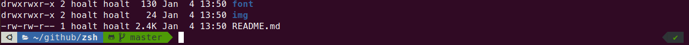

# ZSH



## Install zsh

- MacOS: `shell default is zsh` so don't need install
- Ubuntu: sudo apt install zsh

## Font

- Download these ttf files:
  - [MesloLGS NF Regular.ttf](font/MesloLGS%20NF%20Regular.ttf)
  - [MesloLGS NF Bold.ttf](font/MesloLGS%20NF%20Bold.ttf)
  - [MesloLGS NF Italic.ttf](/MesloLGS%20NF%20Italic.ttf)
  - [MesloLGS NF Bold Italic.ttf](font/MesloLGS%20NF%20Bold%20Italic.ttf)
- Install by **Double-click** on each file and click "Install". This will make `MesloLGS NF` font available to all applications on your system
- Configure your terminal to use this font:
  - **iTerm2**: Open iTerm2 → Preferences → Profiles → Text and set Font to `MesloLGS NF`
  - **Visual Studio Code**: Open File → Preferences → Settings, enter `terminal.integrated.fontFamily` in the search box and set the value to `MesloLGS NF`
  - **GNOME Terminal (the default Ubuntu terminal)**: Open Terminal → Preferences and click on the selected profile under Profiles. Check Custom font under Text Appearance and select `MesloLGS NF Regular`

## Install oh-my-zsh

- <https://github.com/ohmyzsh/ohmyzsh>

```shell
sh -c "$(curl -fsSL https://raw.githubusercontent.com/ohmyzsh/ohmyzsh/master/tools/install.sh)"
```

- After install **`on macOS`** run command as below (optional)

```shell
compaudit | xargs chmod g-w,o-w
```

## Install themes

- <https://github.com/ohmyzsh/ohmyzsh/wiki/Themes>
- <https://github.com/ohmyzsh/ohmyzsh/wiki/External-themes>

### powerlevel10K

```shell
git clone --depth=1 https://github.com/romkatv/powerlevel10k.git ${ZSH_CUSTOM:-$HOME/.oh-my-zsh/custom}/themes/powerlevel10k
```

- Set `ZSH_THEME="powerlevel10k/powerlevel10k"` in ~/.zshrc
- Reopen Terminal
- Type `p10k configure` if the configuration wizard doesn't start automatically

### gozilla

- Set `ZSH_THEME="gozilla"` in ~/.zshrc
- Reopen Terminal

## Install plugins

### zsh-autosuggestions

```shell
git clone https://github.com/zsh-users/zsh-autosuggestions ${ZSH_CUSTOM:-~/.oh-my-zsh/custom}/plugins/zsh-autosuggestions
```

- Activate the plugin in ~/.zshrc: `plugins=(zsh-autosuggestions)`
- Reopen Terminal

### zsh-syntax-highlighting

```shell
git clone https://github.com/zsh-users/zsh-syntax-highlighting.git ${ZSH_CUSTOM:-~/.oh-my-zsh/custom}/plugins/zsh-syntax-highlighting
```

- Activate the plugin in ~/.zshrc: `plugins=(zsh-syntax-highlighting)`
- Reopen Terminal

### fzf

```shell
git clone --depth 1 https://github.com/junegunn/fzf.git ~/.fzf
~/.fzf/install
```

-> **Remember to answer “y” to all questions**

- Press `Ctrl+T` to search for files
- Press `Ctrl+R` to search for commands in your history
